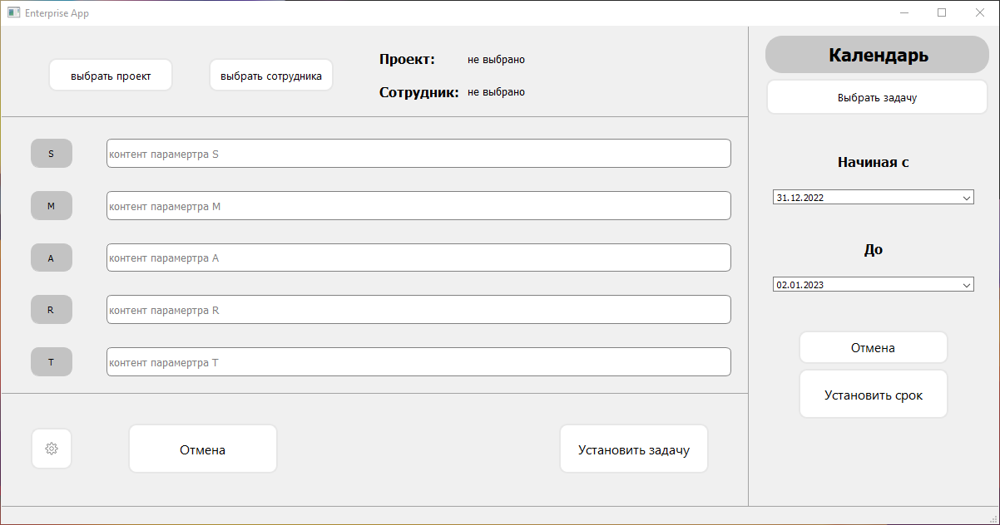

 

  <h3 align="center">The program of setting tasks to employees</h3>

  

    <a href="https://youtu.be/pPef3GDI72Q">Ролик</a>
    .
  

## About The Project

Программная оболочка – это своего рода агрегатор данных из таблицы Excel, позволяет создавать автоматические письма (Outlook /
Thunderbird) и принимать письма с определенными тегами в теме письма и теле письма.

## Built With

* [Pyside2](https://doc.qt.io/qtforpython-5/gettingstarted-windows.html)
* [Openpyxl](https://openpyxl.readthedocs.io/en/stable/)
* [MSAL](https://learn.microsoft.com/ru-ru/azure/active-directory/develop/msal-overview)

## Getting Started

### Prerequisites

Скачать скомпилированную версию по ссылке.

### Installation

1. Скачать архив

2. Распаковать

3. Установить (от имени админа)

4. Запустить (к пр. с рабочего стола)

## License

No license for now.

## Authors

* **M1rtex** - *Programmer Student* - [M1rtex](https://github.com/M1rtex/) - *Created and released alfa*
